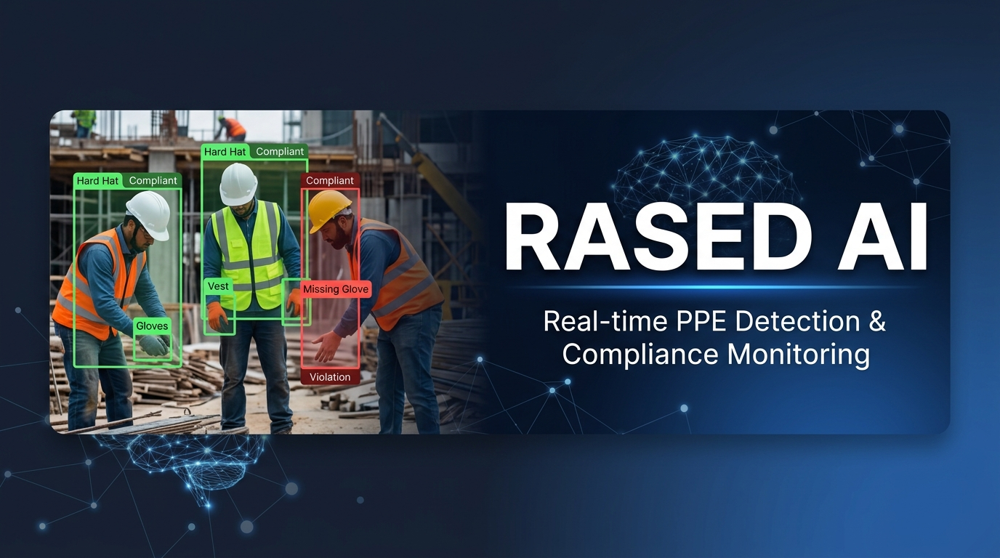
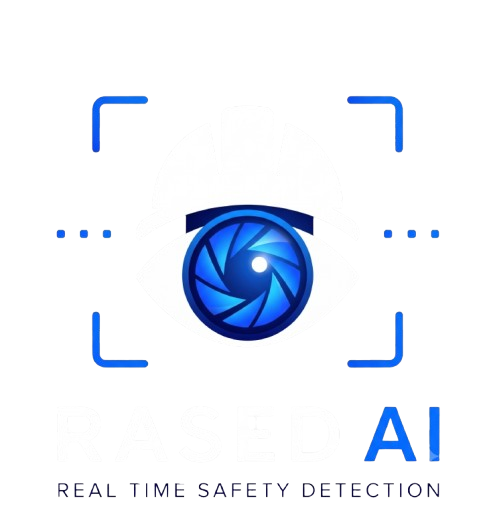
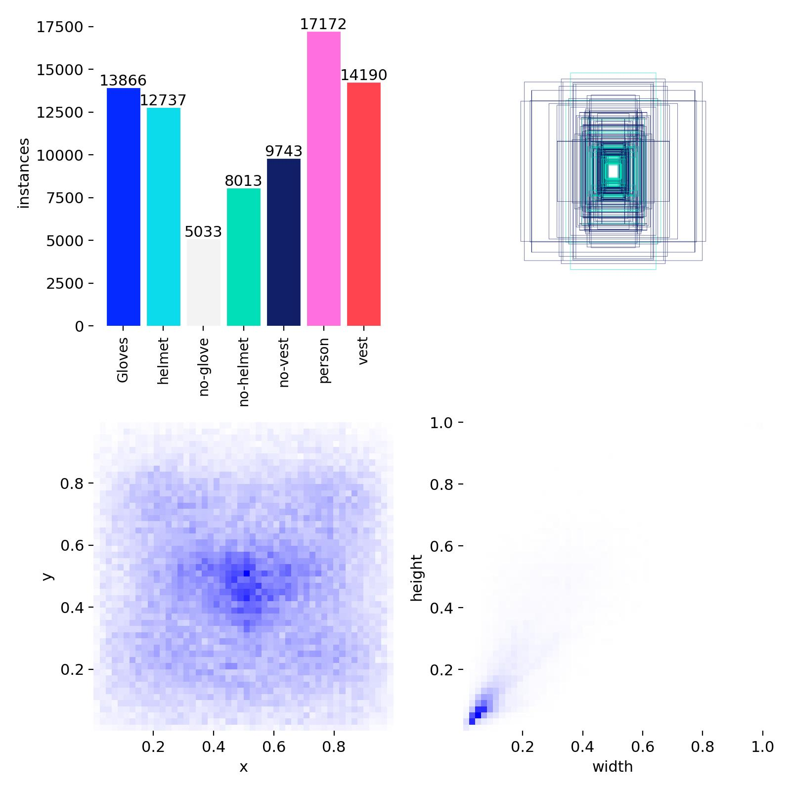
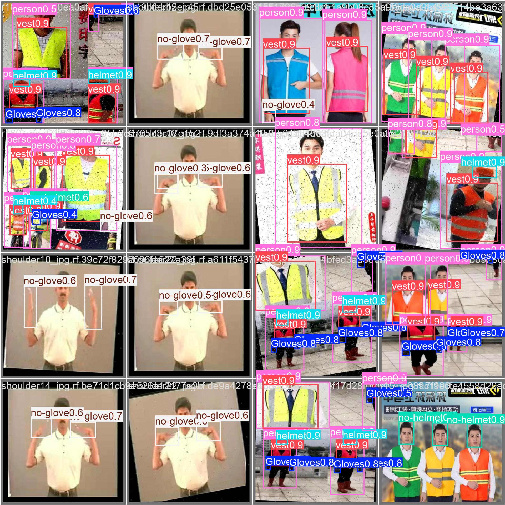
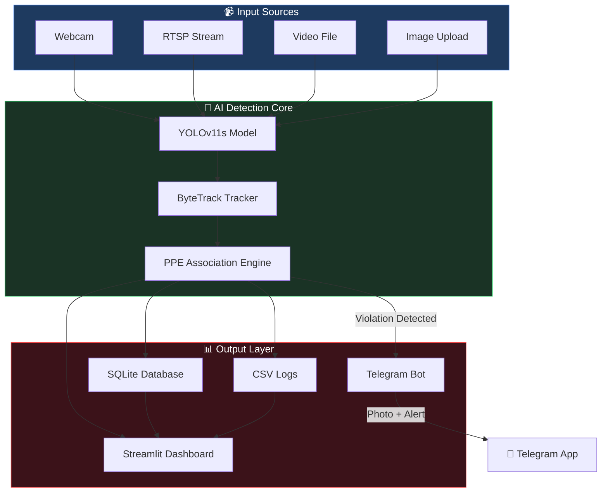
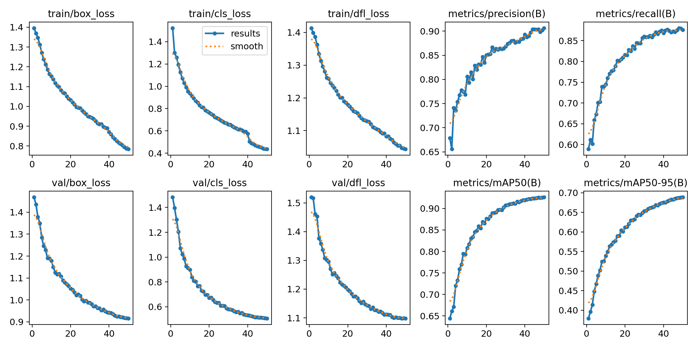
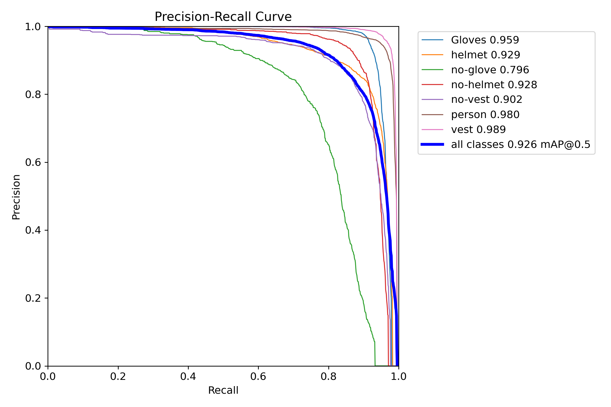
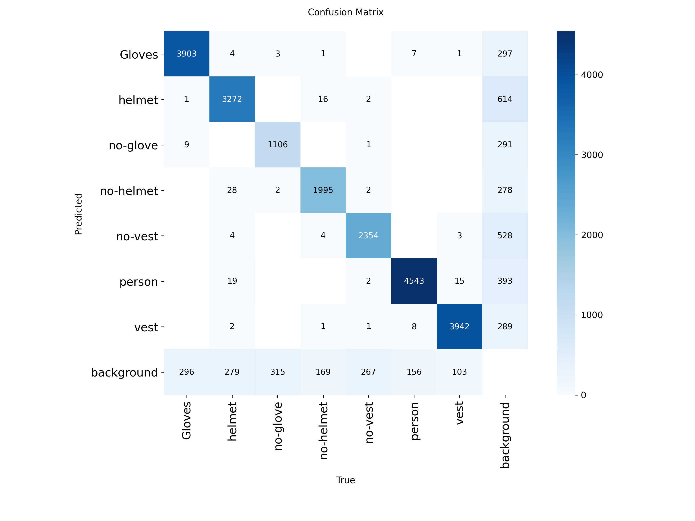
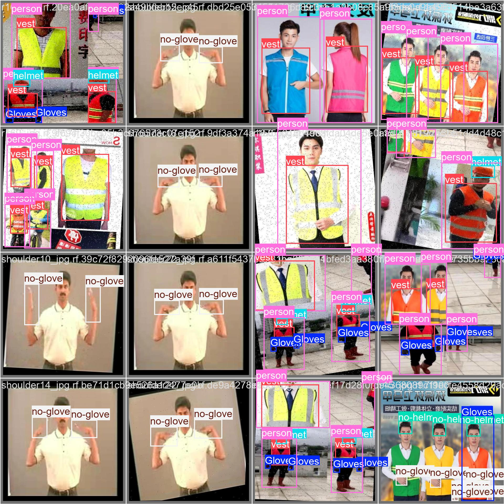

<p align="center">
  
</p>

<h1 align="center">🛡️ RASED AI — Real-time AI Safety Equipment Detection</h1>

<p align="center">
  
</p>

<p align="center">
  <b>An intelligent PPE compliance monitoring system powered by YOLOv11 & Streamlit</b>
</p>

<p align="center">
  
  
  
  
  
  
</p>

---

## 📋 Table of Contents

- [🚨 The Problem](#-the-problem)
- [💡 Our Solution](#-our-solution)
- [🏗️ System Architecture](#️-system-architecture)
- [🎯 Model Performance](#-model-performance)
- [📊 Training Results](#-training-results)
- [🗂️ Project Structure](#️-project-structure)
- [⚡ Quick Start](#-quick-start)
- [🖥️ Usage](#️-usage)
- [📱 Telegram Alerts](#-telegram-alerts)
- [🛠️ Configuration](#️-configuration)
- [🤝 Contributing](#-contributing)
- [📄 License](#-license)

---

## 🚨 The Problem

<table>
<tr>
<td width="60%">

### Workplace Safety is at Risk

Construction sites and industrial workplaces are among the most dangerous environments globally:

- **🔴 2.3 million** workers die from occupational accidents annually (ILO)
- **🔴 340 million** workplace accidents occur every year
- **🔴 70%** of fatal construction injuries could be prevented with proper PPE
- **🔴 $170 billion** annual cost of workplace injuries and illnesses

**Traditional safety monitoring** relies on human supervisors who:
- ❌ Cannot monitor all workers simultaneously
- ❌ Get fatigued during long shifts
- ❌ Miss violations in crowded or distant areas
- ❌ Provide inconsistent enforcement
- ❌ Cannot generate real-time compliance analytics

</td>
<td width="40%">



*Dataset distribution across 7 PPE classes with 80,754+ annotated instances*

</td>
</tr>
</table>

---

## 💡 Our Solution

<p align="center">
  
</p>

<p align="center"><i>Real-time PPE detection showing Helmets, Vests, Gloves, and violation identification</i></p>

### RASED AI: Automated PPE Compliance Monitoring

**RASED AI** is an end-to-end, real-time Personal Protective Equipment (PPE) detection and compliance monitoring system that uses deep learning to automatically detect whether workers are wearing required safety gear.

<table>
<tr>
<td align="center" width="25%">
<h3>🎯</h3>
<b>7-Class Detection</b><br/>
Helmet, Vest, Gloves<br/>+ their violation states
</td>
<td align="center" width="25%">
<h3>⚡</h3>
<b>Real-time Processing</b><br/>
Live webcam, RTSP stream,<br/>or video file analysis
</td>
<td align="center" width="25%">
<h3>📊</h3>
<b>Analytics Dashboard</b><br/>
Compliance rates, trends,<br/>violation breakdowns
</td>
<td align="center" width="25%">
<h3>🔔</h3>
<b>Instant Alerts</b><br/>
Telegram notifications<br/>with violator snapshots
</td>
</tr>
</table>

### ✨ Key Features

| Feature | Description |
|---------|-------------|
| 🧠 **YOLOv11s Detection** | State-of-the-art object detection fine-tuned on 80K+ PPE images |
| 🏃 **ByteTrack Tracking** | Multi-person tracking with persistent ID assignment |
| 📹 **Multi-Source Input** | Webcam, RTSP/IP camera, local video files, image upload |
| 📈 **Live Dashboard** | Streamlit-based UI with real-time stats, charts, and compliance metrics |
| 🔔 **Telegram Alerts** | Automatic violation alerts with cropped violator photos |
| 🗄️ **Dual Storage** | SQLite database + CSV logging for persistence & portability |
| 🌗 **Dark/Light Theme** | Professional dashboard with theme toggle |
| 👤 **Face Cropping** | Automatic violator identification snapshots |

---

## 🏗️ System Architecture



### Detection Pipeline

```
Video Frame ──► YOLO11s Inference ──► ByteTrack Multi-Person Tracking
                    │                           │
                    ▼                           ▼
            PPE Item Detection          Person Bounding Boxes
            (Helmet, Vest, Gloves)      (with persistent IDs)
                    │                           │
                    └────────────┬──────────────┘
                                 ▼
                    Person ↔ PPE Association
                    (IoU-based overlap matching)
                                 │
                    ┌────────────┼──────────────┐
                    ▼            ▼              ▼
              ✅ Compliant   ❌ Violation    📊 Statistics
                              │              (Dashboard)
                              ▼
                    🔔 Telegram Alert
                    (with face crop)
```

---

## 🎯 Model Performance

The model was trained using **YOLOv11s** on a custom dataset with **80,754 annotated instances** across **7 classes**.

### Training Configuration

| Parameter | Value |
|-----------|-------|
| Base Model | YOLOv11s (pretrained on COCO) |
| Epochs | 50 |
| Image Size | 640×640 |
| Batch Size | 16 |
| Optimizer | Auto (SGD with momentum) |
| Learning Rate | 0.01 → 0.0001 (cosine decay) |
| GPU | NVIDIA GPU (CUDA) |
| Training Time | ~3.6 hours |

### Final Metrics (Epoch 50)

| Metric | Value |
|--------|-------|
| **mAP@0.5** | **92.6%** |
| **mAP@0.5:0.95** | **68.9%** |
| **Precision** | **90.6%** |
| **Recall** | **87.6%** |

### Per-Class AP@0.5

| Class | AP@0.5 | Notes |
|-------|--------|-------|
| 👕 Vest | 98.9% | Highest — large, colorful, easy to detect |
| 👤 Person | 98.0% | Full-body detection |
| 🧤 Gloves | 95.9% | Small objects — impressive accuracy |
| 🔨 Helmet | 92.9% | Consistent head-region detection |
| ❌ No-Helmet | 92.8% | Strong violation detection |
| ❌ No-Vest | 90.2% | Absence detection |
| ❌ No-Glove | 79.6% | Hardest — small, variable hand positions |

---

## 📊 Training Results

### Loss & Metrics Curves

<p align="center">
  
</p>

<p align="center"><i>Training and validation loss curves showing consistent convergence over 50 epochs</i></p>

### Precision-Recall Curve

<p align="center">
  
</p>

<p align="center"><i>PR curve with 92.6% overall mAP@0.5 — strong performance across all classes</i></p>

### Confusion Matrix

<p align="center">
  
</p>

<p align="center"><i>Confusion matrix showing high diagonal values = accurate per-class classification</i></p>

### Validation Predictions

<table>
<tr>
<td width="50%">

<p align="center"><b>Ground Truth Labels</b></p>
</td>
<td width="50%">

<p align="center"><b>Model Predictions</b></p>
</td>
</tr>
</table>

---

## 🗂️ Project Structure

```
RASED-PPE-Detection/
│
├── 📄 README.md                 # This file
├── 📄 LICENSE                   # MIT License
├── 📄 CONTRIBUTING.md           # Contribution guidelines
├── 📄 requirements.txt          # Python dependencies
├── 📄 .gitignore                # Git ignore rules
│
├── 🚀 app.py                   # Main Streamlit dashboard (2600+ lines)
├── 🧠 detector.py              # YOLO + ByteTrack detection engine
├── ⚙️ config.py                # Central configuration
├── 🗄️ database.py              # SQLite persistence layer
├── 📱 telegram_bot.py          # Telegram alert system
├── 🌐 stream_server.py         # Streaming utilities
│
├── 📂 utils/
│   ├── __init__.py              # Package init
│   ├── inference.py             # Single-image YOLO inference
│   └── logger.py                # CSV logging & statistics
│
├── 📂 weights/
│   ├── best.pt                  # Best trained model weights
│   └── last.pt                  # Last epoch weights
│
├── 📂 assests/                  # Training artifacts & images
│   ├── results.png              # Training curves
│   ├── confusion_matrix.png     # Confusion matrix
│   ├── BoxPR_curve.png          # Precision-Recall curve
│   ├── results.csv              # Per-epoch training metrics
│   ├── labels.jpg               # Dataset distribution
│   └── train_batch*.jpg         # Training sample visualizations
│
├── 📂 static/
│   └── faces/                   # Auto-cropped violator snapshots
│
└── 📂 docs/
    └── architecture.md          # Detailed system architecture
```

---

## ⚡ Quick Start

### Prerequisites

- **Python 3.10+**
- **pip** package manager
- **Webcam** (optional, for live detection)
- **NVIDIA GPU** (recommended for real-time performance)

### Installation

```bash
# 1. Clone the repository
git clone https://github.com/YOUR_USERNAME/RASED-PPE-Detection.git
cd RASED-PPE-Detection

# 2. Create virtual environment
python -m venv venv

# 3. Activate virtual environment
# Windows:
venv\Scripts\activate
# Linux/macOS:
source venv/bin/activate

# 4. Install dependencies
pip install -r requirements.txt

# 5. Download model weights (if not included)
# Place best.pt in the weights/ directory
```

### Launch

```bash
# Start the dashboard
streamlit run app.py
```

The dashboard will open at **http://localhost:8501** 🚀

---

## 🖥️ Usage

### 1. Live Webcam Detection
- Open the dashboard
- Select **"Webcam"** as the input source
- Click **"Start Detection"**
- View real-time PPE compliance monitoring

### 2. Video File Analysis
- Upload a video file through the dashboard
- The system processes each frame with YOLO detection
- View annotated results and compliance statistics

### 3. Image Upload
- Upload individual images for PPE analysis
- Get instant detection results with bounding boxes
- View detailed compliance breakdown

### 4. RTSP/IP Camera Stream
- Enter your RTSP URL in the dashboard
- Monitor remote cameras in real-time

---

## 📱 Telegram Alerts

RASED AI can send **instant violation alerts** to your Telegram with violator snapshots.

### Setup

1. Create a bot with [@BotFather](https://t.me/botfather) on Telegram
2. Get your chat ID from [@userinfobot](https://t.me/userinfobot)
3. Update `config.py`:

```python
TELEGRAM_BOT_TOKEN = 'your_bot_token_here'
TELEGRAM_CHAT_ID = 'your_chat_id_here'
TELEGRAM_ENABLED = True
```

### Alert Format

```
🚨 PPE VIOLATION ALERT
━━━━━━━━━━━━━━━━━━━━
👤 Person ID: #5
⚠️ Violation: No-Helmet
🕐 Time: 2:30 PM
━━━━━━━━━━━━━━━━━━━━
📍 Action Required!
```

Each alert includes a **cropped snapshot** of the violator for identification.

---

## 🛠️ Configuration

All settings are centralized in [`config.py`](config.py):

```python
# Detection thresholds
CONFIDENCE_THRESHOLD = 0.5    # Minimum confidence for detection
IOU_THRESHOLD = 0.45          # IoU threshold for NMS

# Alert settings
ALERT_COOLDOWN = 60           # Seconds between repeat alerts (same person + violation)
FACE_CROP_PADDING = 20        # Pixels padding around face crops

# Server
HOST = '0.0.0.0'
PORT = 5000
```

### Class Mapping

| Class ID | Label | Color | Type |
|----------|-------|-------|------|
| 0 | Gloves | 🟢 Green | PPE Present |
| 1 | Helmet | 🟢 Green | PPE Present |
| 2 | No-Glove | 🔴 Red | Violation |
| 3 | No-Helmet | 🔴 Red | Violation |
| 4 | No-Vest | 🔴 Red | Violation |
| 5 | Person | 🟠 Orange | Person |
| 6 | Vest | 🟢 Green | PPE Present |

---

## 🧪 Tech Stack

<p align="center">

| Technology | Purpose |
|------------|---------|
|  | PPE detection model |
|  | Interactive web interface |
|  | Real-time frame processing |
|  | Interactive charts |
|  | Detection & alert storage |
|  | Person tracking |
|  | Violation notifications |
|  | Statistics computation |

</p>

---

## 👨‍💻 Meet the Team

<div align="center">
  <table>
    <tr>
      <td align="center" width="33%">
        <a href="https://github.com/Sobhyi">
          <br />
          <sub><b>Abdel Rahman Sobhy</b></sub>
        </a>
      </td>
      <td align="center" width="33%">
        <a href="https://github.com/Ammar-Salah">
          <br />
          <sub><b>Ammar Salah</b></sub>
        </a>
      </td>
      <td align="center" width="33%">
        <a href="https://github.com/ramiz-sayed">
          <br />
          <sub><b>Ramiz Sayed</b></sub>
        </a>
      </td>
    </tr>
  </table>
</div>

## 📄 License

This project is licensed under the **MIT License** — see [LICENSE](LICENSE) for details.

---

<p align="center">
  
</p>

<p align="center">
  <b>RASED AI</b> — Protecting Workers Through Intelligent Vision<br/>
  Built with ❤️ for workplace safety
</p>

<p align="center">
  <a href="#-rased-ai--real-time-ai-safety-equipment-detection">⬆️ Back to Top</a>
</p>
